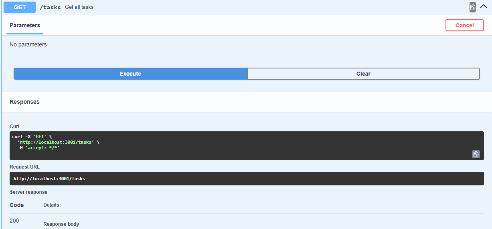
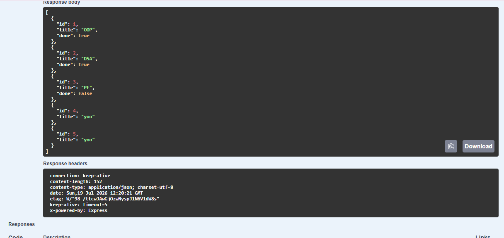

# Crud-API
# Task API
## What is this?

Task API is a simple RESTful CRUD API built using **Node.js and Express.js**.
It allows users to create, view, update, and delete tasks through HTTP requests.

Each task contains:

* `id` → unique identifier
* `title` → task name
* `done` → completion status (`true`/`false`)

The API also includes **Swagger UI documentation** where all endpoints can be tested directly from the browser.

---

## Installation & Running
### 1. Clone the repository

```bash
git clone <your-github-repository-url>
```

### 2. Navigate into the project folder

```bash
cd Crud-API
```

### 3. Install dependencies

```bash
npm install
```

### 4. Run the server

```bash
node server.js
```

The API will run at:

```
http://localhost:3001
```

Swagger documentation is available at:

```
http://localhost:3001/docs
```

---

# API Endpoints

| Method | Endpoint     | Description             |
| ------ | ------------ | ----------------------- |
| GET    | `/tasks`     | Get all tasks           |
| GET    | `/tasks/:id` | Get a task by ID        |
| POST   | `/tasks`     | Create a new task       |
| PUT    | `/tasks/:id` | Update an existing task |
| DELETE | `/tasks/:id` | Delete a task           |

---

# Example Requests

## Create a Task

### Request

```bash
curl -i -X POST http://localhost:3001/tasks -H "Content-Type: application/json" -d "{\"title\":\"Buy milk\"}"
```

### Response

```text
HTTP/1.1 201 Created
X-Powered-By: Express
Content-Type: application/json; charset=utf-8

{
    "id": 1,
    "title": "Buy milk",
    "done": false
}
```

---

# Swagger UI

The API documentation can be accessed through Swagger UI:

```
http://localhost:3001/docs
```

Swagger allows testing all CRUD operations using the **Try it out** button without using curl.

Screenshot:




---

# Project Structure

```
Crud-API
│
├── server.js
├── openapi.json
├── package.json
├── package-lock.json
└── node_modules
```

---

# Technologies Used

* Node.js
* Express.js
* Swagger UI Express
* OpenAPI Specification
